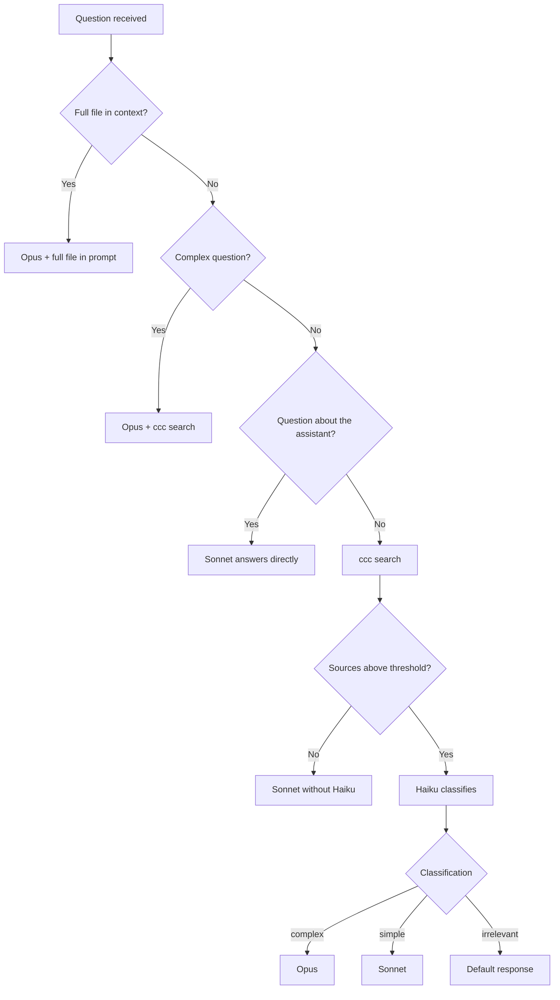

https://mermaid.ai/

```mermaid
flowchart TD
    A[Question received] --> B{Full file in context?}
    B -- Yes --> C[Opus + full file in prompt]
    B -- No --> D{Complex question?}
    D -- Yes --> E[Opus + ccc search]
    D -- No --> F{Question about the assistant?}
    F -- Yes --> G[Sonnet answers directly]
    F -- No --> H[ccc search]
    H --> I{Sources above threshold?}
    I -- No --> J[Sonnet without Haiku]
    I -- Yes --> K[Haiku classifies]
    K --> L{Classification}
    L -- complex --> M[Opus]
    L -- simple --> N[Sonnet]
    L -- irrelevant --> O[Default response]
```