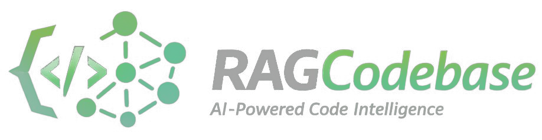

<p align="center">
  
</p>

<p align="center">
  
  
</p>

<p align="right">
  
</p>

# RAG Codebase

Web chat interface with RAG for codebase analysis, integrating semantic search ([cocoindex-code](https://github.com/cocoindex-io/cocoindex-code)) with Claude (Anthropic) via API.

> ⚠️ This is the **official repository** of the RAG Codebase project.  
> Beware of unofficial copies or modified versions that may contain unsafe files.

## 📌 Purpose

Enable Dev, QA, PO, and Support teams to ask natural language questions about source code, directly from the browser, without relying on IDEs or CLI tooling.

### Examples

- Dev:     *"Where is rule X validated?"*
- QA:      *"Which tables are affected by this flow?"*
- PO:      *"Which modules use this entity?"*
- Support: *"What does this warning/error mean?"*

## 🔑 Key Features

- Session-aware chat (per-tab history in the browser)
- Dynamic selection of repository, branch, and layers (back-end, front-end, and/or database)
- Side panel showing files/chunks used in each response
- Token-by-token response streaming
- Markdown rendering with syntax highlighting
- Dark mode
- Confirmation modal when switching context (repo/branch)
- Active context badge visible throughout the session
- Containerized with Docker for server deployment
- Question classifier (simple, complex, irrelevant) with automatic model selection (Sonnet or Opus)
- Search, select, and add a file as context (one at a time)

## 🧩 Architecture

```
Browser (HTML + React via CDN)
        │
        │  POST /chat      (query + session_id + repo + branch)
        │  GET  /stream    (SSE - token streaming)
        ▼
   FastAPI (Python)
        │
        ├─ subprocess: ccc search "<query>" (cwd = clone path)
        │       ▼
        │  cocoindex-code (local semantic index)
        │       ▼
        │  relevant chunks (file, excerpt, score)
        │
        ├─ builds prompt with chunks as context
        │
        └─ Anthropic API (claude-sonnet-4-6, 1M Context)
                ▼
        streaming response → SSE → browser
```

### Session Management

- A `session_id` is generated on page load and persisted per browser tab
- Message history is stored in server memory, keyed by `session_id`
- When switching repository or branch, a confirmation modal is displayed and the session history is discarded

## ⚙️ How It Works - Model Routing

Before calling the main Claude model, the backend traverses a decision tree to select the most appropriate model and avoid unnecessary API calls. The goal is to minimize token cost without compromising response quality.

### Decision Flow


### Route Summary Table

| Route | Condition | Semantic search (ccc search) | Question classification (Haiku) | Final model |
|---|---|:---:|:---:|---|
| File in context | `context_file` present | ✗ | ✗ | Opus |
| Complex question | match in `COMPLEX_TRIGGERS` | ✓ | ✗ | Opus |
| Question about the assistant | match in `ASSISTANT_TRIGGERS` | ✗ | ✗ | Sonnet |
| No relevant sources | 0 chunks above threshold | ✓ | ✗ | Sonnet |
| Irrelevant question | Haiku → `irrelevant` | ✓ | ✓ | Default response (no Claude) |
| Simple question | Haiku → `simple` | ✓ | ✓ | Sonnet |
| Complex question | Haiku → `complex` | ✓ | ✓ | Opus |

### Step-by-Step Details

- **File in context**
Triggered when the user selects a source in the side panel and clicks "Use as context". The full file content is injected into the prompt alongside the question. No new `ccc search` is executed (chunks from the previous search are reused as additional context). Opus is chosen because full-file analysis is the most demanding task.

- **`COMPLEX_TRIGGERS`**
A keyword list evaluated locally (no API cost). If the question matches any keyword, Opus is invoked directly and Haiku is skipped.

- **`ASSISTANT_TRIGGERS`**
A list of expressions indicating questions about the assistant itself. When detected, `ccc search` is skipped entirely (no relevant code to retrieve).

- **ccc search + threshold**
Executes semantic search against the local index. Chunks with a score below `MIN_SCORE_THRESHOLD` (0.40) are discarded. If no chunks remain, Sonnet responds directly without invoking Haiku.

- **Haiku (classifier)**
Invoked only when relevant sources exist and no keyword/trigger was matched. Classifies the question as `complex`, `simple`, or `irrelevant` using `max_tokens=10` and `temperature=0.0`. The cost is minimal (~300–400 input tokens).

- **`ROUTE_SKIP`**
When Haiku returns `irrelevant` (outside the code/system context), the default response is emitted directly via SSE, no call to the main Claude model is made and the chunk tokens are never sent.

## 🛠️ Tech Stack

| Layer | Technology |
|---|---|
| Backend | FastAPI (Python) |
| Frontend | React 18 via CDN (no build step) |
| Styling | Tailwind CSS via CDN |
| Markdown | marked.js via CDN |
| Syntax highlighting | highlight.js via CDN |
| Semantic search | cocoindex-code (`ccc search`) |
| LLM | Anthropic API - Claude Sonnet 4.6 (1M Context) |
| Streaming | Server-Sent Events (SSE) |
| Containerization | Docker + Docker Compose |

## 📁 Project Structure

```
rag-codebase/
├── app/
│   ├── main.py              # FastAPI - endpoints, sessions, ccc + Anthropic integration
│   ├── config.yml           # repo/branch → local path mapping
│   └── static/
│       └── index.html       # React SPA via CDN (full UI)
├── Dockerfile
├── docker-compose.yml
├── pyproject.toml
├── uv.lock
└── .env.example             # required environment variables
```

## 📦 Dependencies

External dependencies required before executing the project.

### Python
```bash
sudo apt update
sudo apt install python3 python3-pip pipx
```

### cocoindex-code
```bash
# Install cocoindex-code
pipx install 'cocoindex-code[full]==0.2.34'

# Create the '~/.cocoindex_code/global_settings.yml' configuration file
ccc init

# Reset local settings
ccc reset --all

# Run diagnostics
ccc doctor
```

### Embeddings Model

File `~/.cocoindex_code/global_settings.yml`:
```yaml
model: nomic-ai/CodeRankEmbed  # trained specifically for source code
device: cuda                   # if omitted, auto-detected (CPU as fallback)
query_params:
    prompt_name: query
indexing_params:
    prompt_name: document
```

> The similarity threshold `MIN_SCORE_THRESHOLD = 0.40` and the proportional chunk selection percentages (`CHUNK_SELECTION_TIERS`) defined in `main.py` were tuned based on the scores produced by this model. Changing the embeddings model requires recalibrating these parameters.

## 🔧 Configuration

### Environment Variables

Copy `.env.example` to `.env` and fill in:

- Without Docker (development):
```env
ANTHROPIC_API_KEY=sk-ant-...
CODEBASE_ROOT=/opt/rag/codebase
```

- With Docker (production):
```env
ANTHROPIC_API_KEY=sk-ant-...
CODEBASE_ROOT=/codebase
CODEBASE_HOST_PATH=/opt/rag/codebase
```

### Repository Mapping

Available repositories and branches are configured in [config.yml](/app/config.yml). Each repository/branch combination corresponds to an independent Git clone with its own `cocoindex-code` index.

> The update policy (`git pull`) and reindexing (`ccc index`) of repositories is managed by external automated schedules, outside this project.

## 💻 Running Locally (WSL/Ubuntu)

### Prerequisites

- Python 3.11+ (`python3 --version`)
  - uv (`uv --version`)
  > To install `uv`, you must run the command: `curl -LsSf https://astral.sh/uv/install.sh | sh`.
- `cocoindex-code` installed via pipx (`ccc` available on PATH)
- Indexes already built in the clones (`ccc index` run in each path)
- `ANTHROPIC_API_KEY` and `CODEBASE_ROOT` set in `.env`

### Setup and Execution

```bash
# Clone the repository and set up the git-hooks submodule
git clone https://dev.azure.com/grupo-siagri/ia/_git/rag-codebase
cd rag-codebase && chmod +x getting-started.sh && ./getting-started.sh

# Start the server
uv run uvicorn app.main:app --reload --port 8000
```

Access at `http://localhost:8000`.

## 🚀 Production Server Deployment (Docker)

### Prerequisites

- Docker and Docker Compose installed
- Repository clones available on the server with `cocoindex-code` indexes already built
- `ANTHROPIC_API_KEY`, `CODEBASE_ROOT` and `CODEBASE_HOST_PATH` set in `.env`
  > `docker-compose.yml` bind-mounts the clones directory into the container.
- Port 8000 open (or configure a reverse proxy via Nginx/Caddy)

### Commands

```bash
# Build and run
docker compose up -d

# Logs
docker compose logs -f

# Stop
docker compose down
```

## 👤 Author

**Alex Ferreira de Almeida**  
Software Engineer  

## 🔒 Disclaimer

This repository contains **public documentation only**.  
The actual source code of the RAG Codebase is private and cannot be published due to internal processes, proprietary integrations, and corporate security policies.

This README exists solely to document the project’s existence, architecture, design principles, and authorship.

## 📝 License

This project is licensed under the [MIT License](LICENSE).

You are free to use, modify, and distribute this project for personal or commercial purposes, provided that the original authorship and license notice are preserved.

## 📅 Project Status

**Active - 2026 to Present**  
